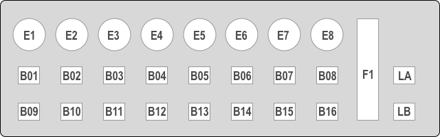

# xair-remote

Use a Behringer X-Touch Mini MIDI controller to remote control a Behringer X-Air digital mixer via the OSC network protocol. Multiple layers allow you to control volume, mute and bus sends for every input and output channel with only 8 physical encoders. Changes on the mixer will also be displayed accurately on the X-Touch controller.

## Installing

You need Python 3.5 or later. Please make sure to install required libraries:

	$ sudo pip3 install -r requirements.txt

## Update

If you update from a previous version, please make sure that you run at least Python 3.5 and install all required libraries as described in the previous section.

The X-Touch device now needs to be running in MC mode. Make sure that the MC LED is lit after connecting the device by pressing the MC button during startup.

## Running

To get help run:

	$ python3 xair-remote.py -h

The app will automatically detect both your X-Touch controller and the XR18. So connect the controller and make sure the XR18 is reachable on your network. Now you can start the app:

	$ python3 xair-remote.py

If the app can not find your controller or connect to the X-Air mixer, it will terminate with an error message explaining the problem. If everything started up successfully, the X-Touch mini will reflect the current mixer state and the console output will look like this:

	Found XR18 with firmware 1.17 on IP 192.168.178.31
	Using MIDI input: X-TOUCH MINI
	Using MIDI output: X-TOUCH MINI
	Successfully connected to XR18 with firmware 1.17 at 192.168.178.31.

Startup will fail if the X-Touch controller is not connected or the XR18 could not be located on the network. In the latter case you could try to specify the IP address of the mixer on the command line:

	$ python3 xair-remote.py 192.168.178.37

The app can monitor the X-Touch connection and exit if the controller is disconnected. This functionality is enabled by setting the parameter `-m`:

	$ python3 xair-remote.py -m
	
Note: Monitoring does not work on all platforms. Linux works fine while MacOS does not detect disconnects.

## Using

The following image is a schematic of all available controls on the X-Touch Mini:

You need to configure the device to start in MC mode. If the MC mode LED is not lighted, hold down the MC button while connecting the device. 

To exit press `CTRL + C`.

The folder `labels` contains labels to print and attach to your X-Touch as PDF and Excel files. You can change the labels to your specific setup. Make sure you print them in 100% size.

### Layer A

Layer A is used to control the main mix.

This layer is active when the button `LA` is selected. The main volume is always mapped to the Fader `F1`. The lower button row is assigned globally with the following functions:

Button | Function
------ | ------------------------------------------------
B09    | Mute Group 4 (this is always my FX mute group)
B10    | Tap Tempo (will set tempo for all delay effects)
B11    | Unassigned
B12    | Fader Bank 1
B13    | Fader Bank 2
B14    | Fader Bank 3
B15    | Fader Bank 4
B16    | Fader Bank 5 

The upper row buttons and the top encoders are used to control volume and mute for different channels depending on the selected fader bank:

Bank | Encoders (Volume) & Buttons (Mute)
---- | ----------------------------------
1    | Channels 1 - 8
2    | Channels 9 - 16
3    | Aux, 3 unassigned, DCA 1 - 4
4    | FX Sends 1 - 4, FX Returns 1 - 4
5    | Bus 1 - 6, 2 unassigned

The Push function of encoders `E1` to `E4` can be used to toggle mute groups 1 to 4 in all fader banks. I always use mute group 4 for FX mute, therefore I have placed this mute group on button `B09`. This way I also get visual feedback on the status of my FX returns.

### Layer B

Layer B can control your bus sends.

This layer is active when the button `LB` is selected. The main volume is always mapped to the Fader `F1`.

In this layer all buttons have a static assignment:

Button | Function
------ | ------------------------------------------------
B01    | Bus 1
B02    | Bus 2
B03    | Bus 3
B04    | Bus 4
B05    | Bus 5
B06    | Bus 6
B07    | FX 1
B08    | FX 2
B09    | Mute Group 4 (this is always my FX mute group)
B10    | Tap Tempo (will set tempo for all delay effects)
B11    | Unassigned
B12    | Fader Bank 1
B13    | Fader Bank 2
B14    | Fader Bank 3
B15    | FX 3
B16    | FX 4

The top encoders control the volume for different channels depending on the selected fader bank and bus/FX:

Layer | Encoders (Volume)
----- | ----------------------------------
1     | Channels 1 - 8
2     | Channels 9 - 16
3     | Aux, 7 unassigned

The Push function of encoders `E1` to `E4` can be used to toggle mute groups 1 to 4 in all fader banks.

## License

This project is licensed under the MIT License - see the [LICENSE](LICENSE) file for details
